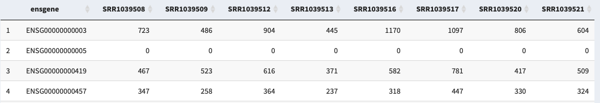
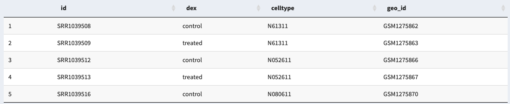

<h1>Introduction</h1>
---

This is an R Shiny web interactive application developed as part of a <b>course project</b>. The purpose of this application is to perform an <b>analysis from a counts table</b> in order to help researchers getting interpretable results.

This application uses the package <a href="https://bioconductor.org/packages/release/bioc/html/DESeq2.html" target="_blank">DESeq2</a> from Bioconductor to allow quick visualization of results in order to analyze the counts table data. The results will be given in different form like graphics, heatmaps, MAplot or even Volcano plot.

<h2>Input files</h2>
---
<h3>Counts table</h3>
Accepted files : 
<li> .csv / .tsv / .txt files </li>
<li> Separated by tabulation, comma or semi-colon </li>
<li> First column has to be gene ID or gene name </li>
<li> All others columns are count for each sample </li>

<strong>Example of count table</strong>

---

<h3>Metadata table</h3>
Accepted files : 
<li> .csv / .tsv / .txt files </li>
<li> Separated by tabulation, comma or semi-colon </li>
<li> First column has to be gene ID or gene name </li>
<li>  </li>

<strong>Example of metadata file</strong>

